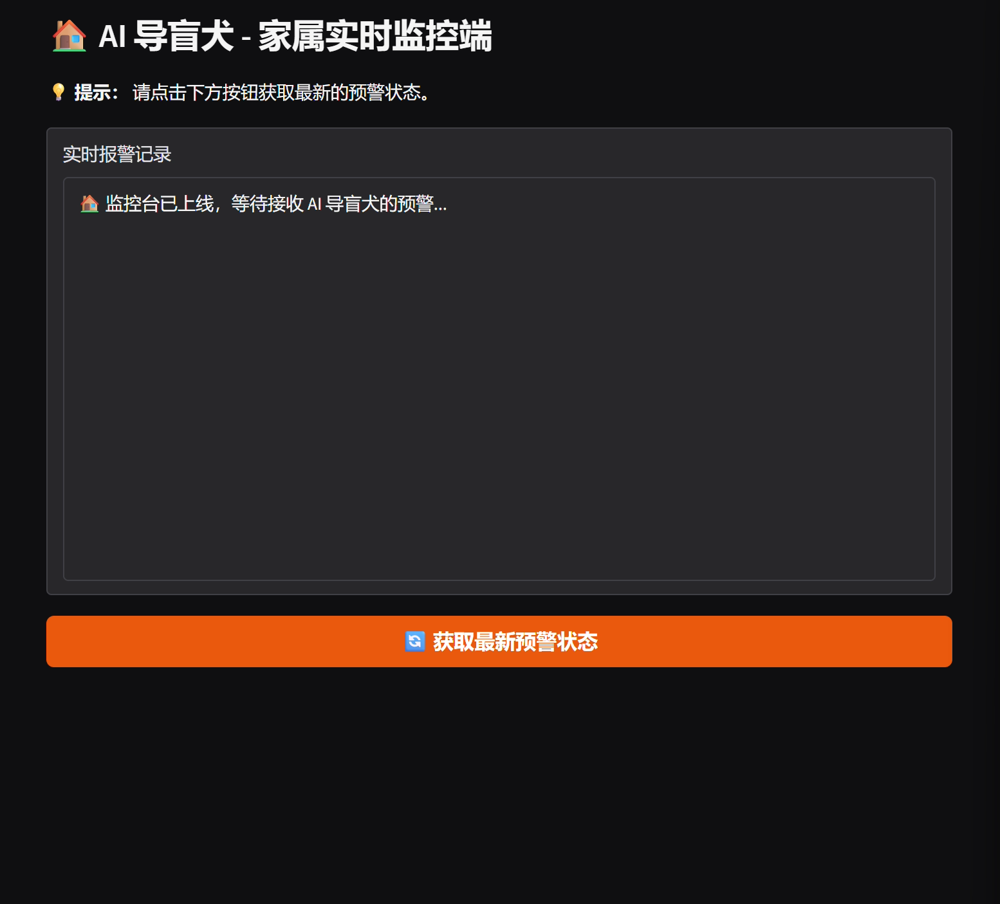

AI 导盲犬X 项目说明
——基于 Qwen2-VL 与 OpenClaw 的闭环安全辅助系统

## 📄 [点击查看项目详细报告书](./项目报告书.md)

🏗️ 系统架构
本项目由三个核心模块协同工作：

AI Brain (大脑): 基于 frontend_app.py，负责 Qwen2-VL 模型推理。

Gateway (中枢): 基于 OpenClaw，负责消息路由与跨平台通知。

Monitor (家属端): 基于 family_monitor.py，模拟接收预警信号的远程后台。

🚀 部署指南
1. 环境准备
确保你的环境中已安装 Python 3.10+ 和 CUDA 12.1+（推荐在 NVIDIA GB10 环境下运行）。

Bash
# 克隆仓库
git clone https://github.com/Waisthurt/AI-Blind-Guide.git
cd AI-Blind-Guide

# 安装依赖
pip install -r requirements.txt

1.5 模型权重准备 (Model Weights)
本项目基于 Qwen2-VL-7B-Instruct 开发。由于模型文件较大，请通过以下方式获取并放置于项目根目录：

官方下载：

Bash
# 使用 git-lfs 从 Hugging Face 克隆 (需要显存 > 16GB)
git lfs install
git clone https://huggingface.co/Qwen/Qwen2-VL-7B-Instruct
国内用户建议从 ModelScope (魔搭社区) 下载：

Bash
pip install modelscope
python -c "from modelscope import snapshot_download; snapsh

2. 配置 OpenClaw (网关层)
你需要预先安装并启动 OpenClaw。

修改配置：在 ~/.openclaw/openclaw.json 中添加 Webhook 频道：

JSON
"channels": {
  "feishu": {
    "type": "feishu",
    "url": "http://127.0.0.1:5000/alert"
  }
}

启动网关：

Bash
pnpm run start gateway --port 3000

3. 顺序启动终端 (Critical Order)
请按照以下顺序在三个不同的终端窗口中启动服务：

窗口 1：启动家属监控后台 (接收端)

Bash
python family_monitor.py
确保看到 Running on http://127.0.0.1:5000。

窗口 2：启动 OpenClaw 网关 (中控端)

Bash
cd openclaw
pnpm run start gateway --port 3000
确保看到 [gateway] ready 且加载了 feishu (或 synology-chat) 频道。

窗口 3：启动 AI 导盲大脑 (发起端)

Bash
python frontend_app.py
启动后访问 Gradio 链接，点击分析，此时数据将流经网关并推送到窗口 1。

🛠️ 技术栈
模型: Qwen2-VL-7B-Instruct

平台: NVIDIA Grace Blackwell (GB10)

通信: OpenClaw (Message Gateway)

界面: Gradio (Frontend) & Flask (Family Monitor)

加速: SDPA (Attention Optimization), Bfloat16

⚠️ 免责声明 (Disclaimer)
本项目仅作为 2026 Hackathon 演示作品。由于大模型存在幻觉风险，严禁将本系统在未经专业测试的情况下直接应用于视障人士的真实出行环境。开发者不承担因系统误判导致的任何安全责任。

致谢: 感谢组委会提供的 NVIDIA GB10 顶级算力支持。

💡 写在后面
如果你觉得这个项目对你有启发，欢迎点个 Star ⭐！